<h1>Membuat aplikasi e-learning menggunakan arsitektur model view controller</h1>

<h1>Cara menjalankannya</h1>
<h2>Sebelum menjalankannya pastikan sudah ada dependencies berikut:</h2>
    <ol>
        <li>
            
php versi >= 8

        </li>
        <li>
            
MySQL

        </li>
        <li>
            
Text Editor

        </li>
        <li>
            
Sudah terinstall composer di laptop/pc

        </li>
        <li>
            
apache web server (opsional)

        </li>
    </ol>
<h3>Cara Pertama (via php localhost):</h3>
<ol>
    <li>
        
Import database elearning.sql dan elearning_test.sql ke mysql 

    </li>
    <li>
        
Jika sudah berada di direktori, ketik perintah composer update diterminal

    </li>
    <li>
        
Jika sudah di update, ketik perintah composer dump-autoload  diterminal

    </li>
    <li>
        
Masuk ke direktori public (cd public/)

    </li>
    <li>
        
Masukkan perintah php -S localhost:8080 diterminal (jika portnya bentrok ganti ke port lain misalnya 8081)

    </li>
    <li>
        
Buka browser dan ketik localhost:8080

    </li>
</ol>

<h3>Cara Kedua (via apache web server) nyusul<h3>

<h1>Framework yang digunakan</h1>
<ol>
    <li><a target="_blank" href="https://phpunit.de/">phpunit</a></li>
</ol>
<h1>Contoh UML</h1>
<h3>Dosen Mengelola Data Nilai Kelompok</h3>
<h4>===Sequence Diagram===</h4>
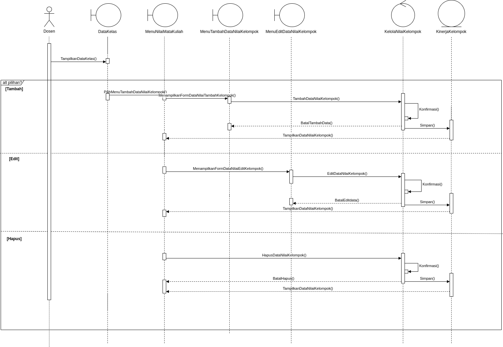
<ol>
    
Fungsi dibawah terdapat dibagian DosenController

    <li>
        
TampilkanDataKelas() => (merender interface DataKelas yang terdapat didalam folder view)

        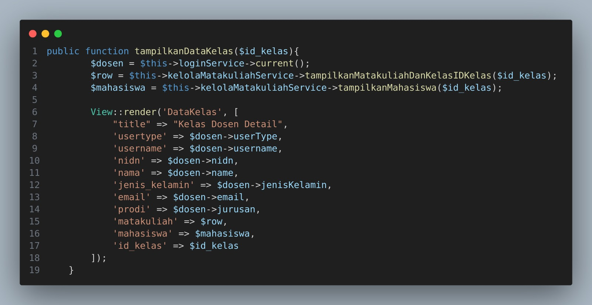
    </li>
    <li>
        
PilihMenuTambahDataNilaiKelompok()

        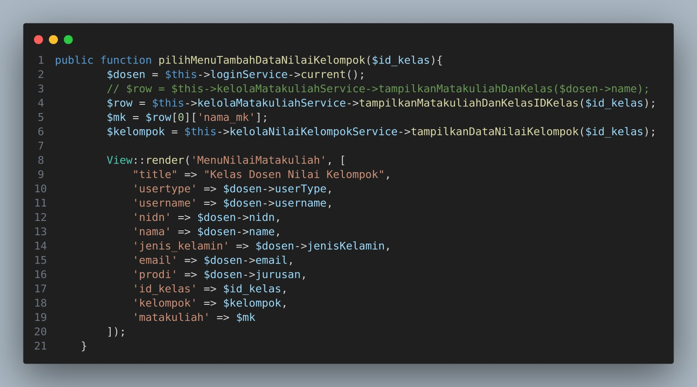
    </li>
    <li>
        
MenampilkanFormDataNilaiTambahKelompok()

        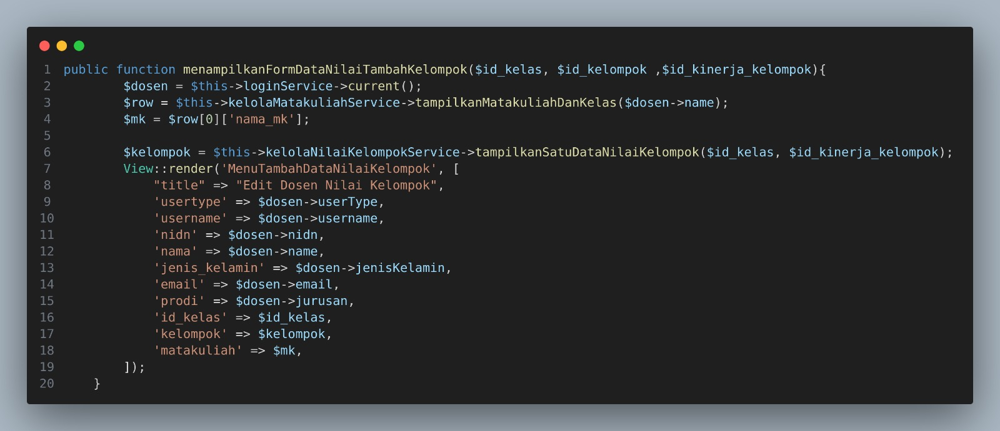
    </li>
    <li>
        
TambahDataNilaiKelompok()

        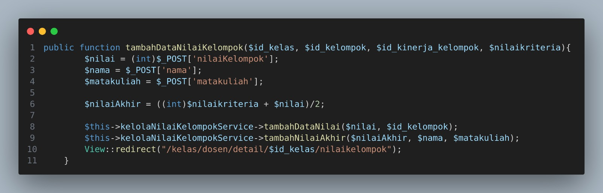
    </li>
    <li>
        
MenampilkanFormDataNilaiEditKelompok()

        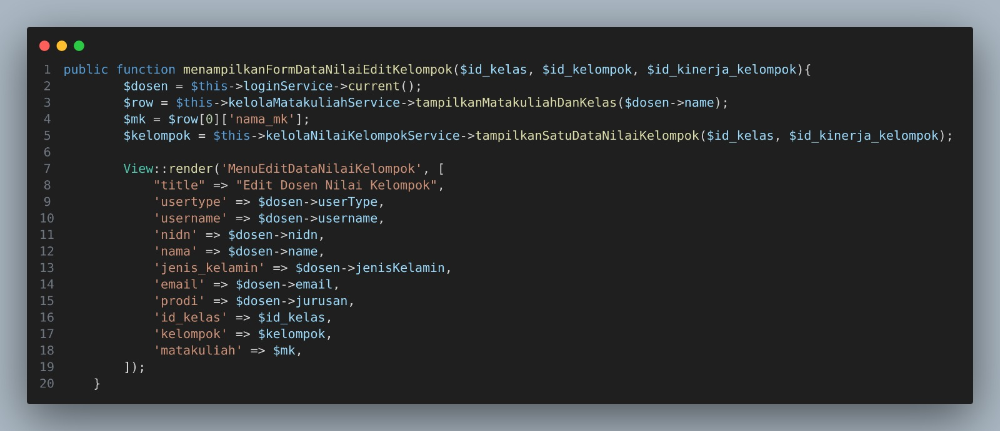
    </li>
    <li>
        
EditDataNilaiKelompok()

        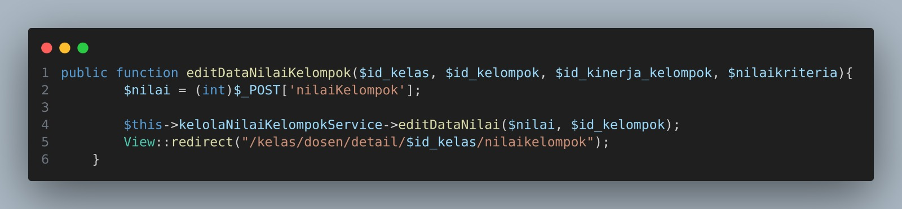
    </li>
    <li>
        
HapusDataNilaiKelompok()

        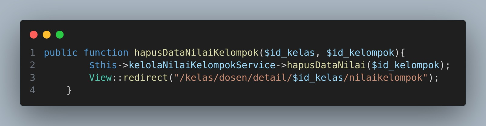
    </li>
</ol>

<h4>===Class Diagram===</h4>
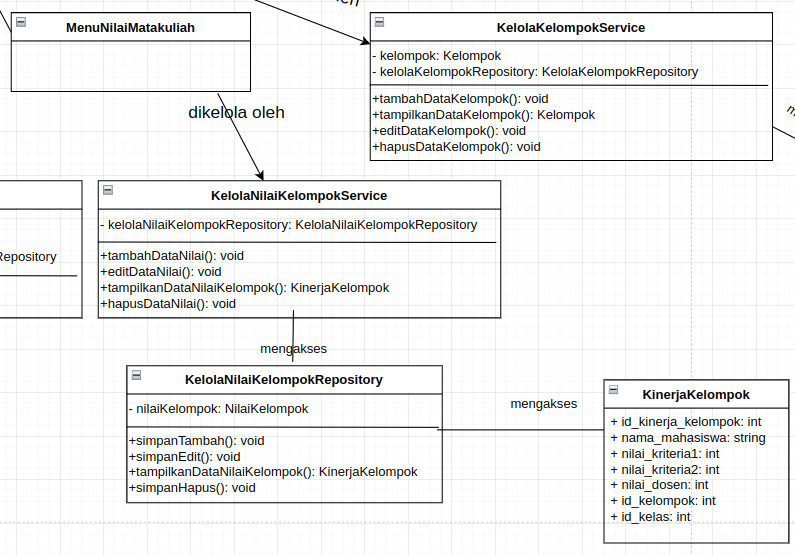

    Menu Nilai Matakuliah dikelola oleh class KelolaNilaiKelompokService yang mengakses KelolaNilaiKelompokRepository.
     
    1. Berikut fungsi yang terdapat pada class KelolaNilaiKelompokService
     
    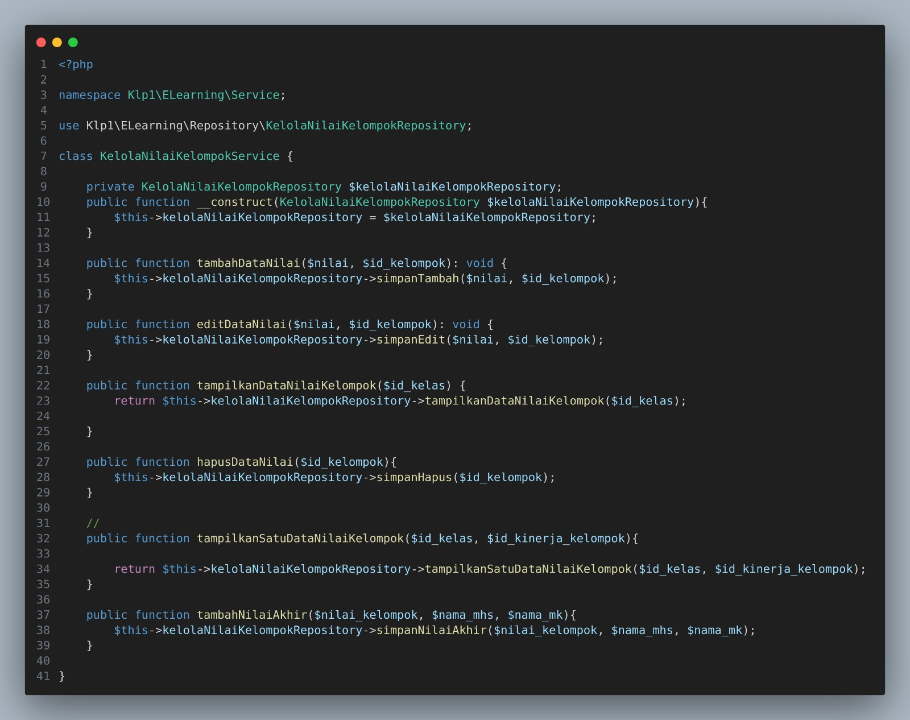
     
    2. Berikut fungsi yang terdapat pada class KelolaNilaiKelompokRepository
     
    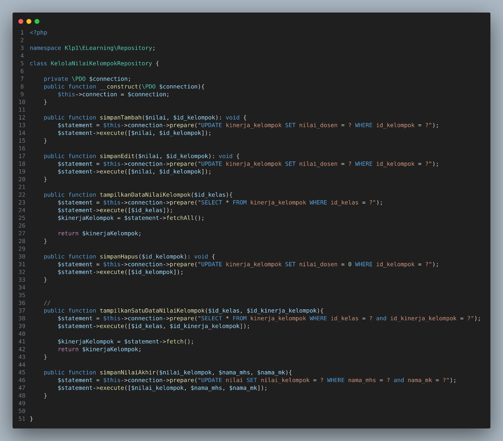

